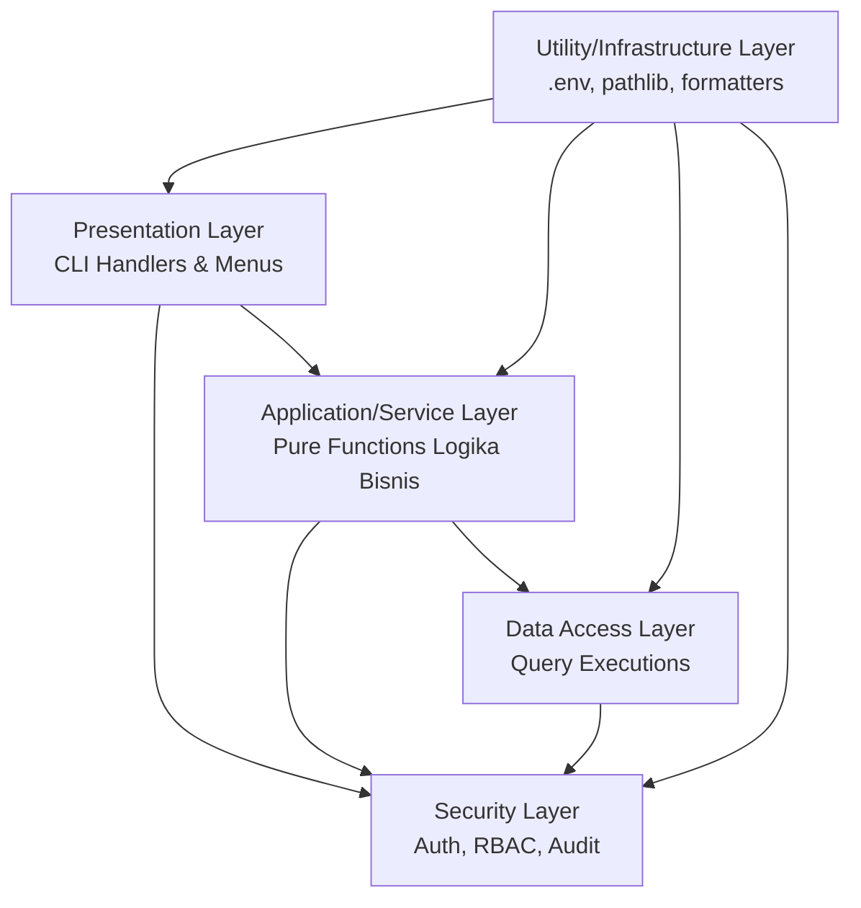

# System Architecture — Sistem Manajemen Usaha Percetakan "AbuCom"

## 1. Metadata Dokumen

| Atribut | Detail |
|---|---|
| **Versi** | 1.0.0 |
| **Status** | [draft] |
| **Tanggal Dibuat** | 2026-05-15 |
| **Disusun Oleh** | Senior Software Architect & Senior System Designer (AI) |

## 2. Pendahuluan

Dokumen System Architecture ini disusun sebagai cetak biru teknis utama yang menjembatani fase Design menuju fase Implementation untuk Sistem Manajemen Usaha Percetakan "AbuCom". Dokumen ini mendefinisikan keseluruhan struktur teknis aplikasi, arsitektur berlapis, pola organisasi kode, struktur direktori, alur data antar komponen, strategi koneksi basis data, mekanisme keamanan, dan strategi penanganan error yang komprehensif.

Aplikasi AbuCom dibangun dengan arsitektur yang memiliki batasan teknis yang mutlak: menggunakan antarmuka CLI monolitik lokal, ditulis dengan paradigma Functional Programming (FP) murni di Python 3.14.2+ (secara tegas menolak penggunaan `class` untuk logika bisnis), berinteraksi dengan pangkalan data MySQL 8.4 LTS, serta dirancang sejak hari pertama agar siap untuk ekspansi cabang jamak (*Multi-Branch Ready*).

## 3. Arsitektur Berlapis (Layered Architecture)

Meskipun aplikasi ini merupakan aplikasi monolitik berbasis CLI yang dikembangkan dengan paradigma fungsional, struktur kode diorganisasikan dalam lapisan logis (*Layered Architecture*) untuk memisahkan tanggung jawab fungsionalitas dan memudahkan pemeliharaan kode oleh Junior Programmer.

Lapisan yang digunakan adalah:

1. **Presentation Layer (CLI)**: Lapisan terluar yang menangani antarmuka pengguna di terminal. Bertanggung jawab merender menu berbasis angka, memproses input *prompt* dari keyboard, dan mencetak output visual (tabel ASCII, format slip digital) ke layar. Lapisan ini tidak memiliki logika bisnis.
2. **Application/Service Layer**: Lapisan operasional yang bertugas menampung sekumpulan *pure functions* berisi logika bisnis utama dari 20 modul aplikasi (misal: perhitungan HPP dari struktur BOM, komputasi skema persentase gaji vs batas 15 juta, dan potongan kasbon). 
3. **Data Access Layer**: Lapisan terbawah yang berisi perantara komunikasi dengan MySQL. Berfungsi sebagai pembungkus fungsional eksekusi `cursor.execute()`, melakukan komitmen dan `rollback` transaksi, serta memformat hasil kembalian database ke dalam bentuk *immutable data* Python (berupa *tuple* atau *dict* murni).
4. **Security Layer**: Lapisan pemroses keamanan yang mengeksekusi pemeriksaan *hashing* `bcrypt`, ekstraksi dan validasi token JWT, pengaturan filter *Role-Based Access Control* (RBAC), serta pencatatan persisten log rekam jejak (*audit trail*).
5. **Utility/Infrastructure Layer**: Kumpulan fungsi teknis penunjang di luar bisnis lintas lapisan. Berfungsi mengelola variabel `.env` dengan `python-dotenv`, resolusi path direktori lintas OS (`pathlib`), manajemen waktu (*datetime*), fungsionalitas generator nama berkas standar, serta skrip utilitas mandiri cadangan (pencadangan dump terenkripsi).

**Aturan Komunikasi Lapisan:** Lapisan atas diperbolehkan untuk memanggil fungsi dari lapisan bawahnya secara langsung. Namun, aturan arsitektural menetapkan dengan sangat keras: lapisan bawah **TIDAK DIPERBOLEHKAN** sekalipun untuk memanggil lapisan di atasnya.



## 4. Struktur Direktori Proyek

Aplikasi memetakan 20 modul fungsional dari *Project Charter* secara terpusat. Direktori disusun mengutamakan kemudahan pelacakan penempatan *pure functions*.

```text
abucom/
├── main.py                     # Entry point (Memuat env, trigger CLI event loop)
├── requirements.txt            # Daftar library versi terkunci (mysql-connector, pyjwt, bcrypt)
├── .env                        # Rahasia konfigurasi (kredensial DB lokal, kunci rahasia JWT)
├── cli/                        # [Presentation Layer]
│   ├── menus.py                # Fungsi render navigasi dinamis berdasar RBAC
│   └── handlers.py             # Fungsi promt masukan pengguna CLI
├── services/                   # [Application/Service Layer]
│   ├── cashier_service.py      # Transaksi Kasir Multi-Lini, Harga Grosir/Mitra, Batal/Retur
│   ├── inventory_service.py    # Gudang Stok, BOM, HPP Produksi, Waste Management
│   ├── job_tracking_service.py # Pelacakan Status Antrian & Lokasi Desain
│   ├── hr_payroll_service.py   # SDM, Kehadiran, Kasbon, Skema Penggajian, Poin Insentif
│   ├── finance_service.py      # Transaksi PPOB, Jasa Keuangan Bank, Hutang Piutang
│   └── crm_report_service.py   # Pelanggan, Laba Rugi, Rekonsiliasi Fisik Laci
├── data/                       # [Data Access Layer]
│   ├── connection.py           # Inisiasi koneksi mysql-connector-python dan konfigurasi cursor
│   ├── queries.py              # Fungsi eksekusi query (CRUD FP Tuple-Based)
│   └── migrations/             # Kumpulan file inisiasi DDL schema MySQL
├── security/                   # [Security Layer]
│   ├── auth.py                 # Pengecekan sandi bcrypt dan penerbitan sesi JWT 8 jam
│   ├── rbac.py                 # Filter hak otonom dan blokir akses ke data milik 'Pemilik'
│   └── audit.py                # Pemasukan rekaman wajib ke entitas audit_trail 
└── utils/                      # [Utility/Infrastructure Layer]
    ├── config.py               # Pemanggilan fungsi konfigurasi dasar os.getenv()
    ├── formatters.py           # Kalkulasi tabel ASCII, konvensi nama desain, konversi numerik desimal
    └── backup.py               # Skrip pendukung pencadangan basis data lokal mysqldump
```

## 5. Alur Data Utama (Data Flow)

Dalam ekosistem tanpa OOP, rangkaian penyelesaian bisnis digubah dalam wujud rentetan panggilan (*chain/composition*) dan eksekusi komputasi fungsi murni.

### 5.1. Alur Autentikasi (Login)
1. **Input CLI**: `prompt_login()` meminta `username` dan `password` di layar.
2. **Validasi (*Verify*)**: Pemanggilan ke Security Layer untuk menarik string hash dari `users` di basis data MySQL.
3. **Pencocokan**: Memanggil `bcrypt.checkpw()` — membandingkan parameter *password* dengan rekaman. Bila salah 5x berturut-turut, fungsi akan mengeksekusi `UPDATE` mengubah `is_locked = 1`.
4. **JWT Generate**: Bila berhasil, fungsi otentikasi memanggil rutin *encode* `pyjwt`, men-generate *payload* berisi parameter `user_id`, `role`, dan `branch_id`, beserta durasi kadaluarsa 8 jam.
5. **Session Store**: Token JWT mendarat di *state* parameter dalam tabel `login_sessions`. Fungsi `log_audit()` otomatis dijalankan guna mencatat bukti `LOGIN`.
6. **Menu Render**: Pemanggilan ke lapisan tampilan. Filter mengekstrak `role` untuk menyaring dan merender menu sesuai otoritas yang diakui.

### 5.2. Alur Transaksi Kasir Multi-Lini
1. **Pemilihan Item**: Fungsi *prompt* CLI meminta jenis pesanan (1. Cetak 2. ATK 3. Layanan PPOB), ID produk, dan jumlah item (*qty* desimal presisi).
2. **Kalkulasi Tier**: *Service Layer* mengambil tipe tier harga `pricing_tiers`. Melalui fungsi `calculate_subtotal`, program mengecek `qty` (grosir bila >= 50) atau `min_active_months` (mitra aktif 3 bulan) tanpa mengganti status basis. Menghitung tagihan DP bila ada pelunasan 50%.
3. **Kalkulasi BOM & HPP**: Bagi pesanan layanan percetakan, *Service Layer* meminta matriks *Bill of Materials* (`bom`). Fungsi reduksi mengekstrak parameter konversi bahan, menghasilkan rincian nilai total material untuk disematkan sebagai komponen `item_hpp`. 
4. **Potong Stok & Catat**: Data parameter dikemas. Fungsi Data Access mengawali `start_transaction()`. Menulis sisipan log transaksi ke `transactions` dan detail pada `transaction_items`. Melakukan `UPDATE` fungsi pengurangan persediaan bahan presisi tinggi di relasi `materials`.
5. **Audit**: Memanggil parameter eksekusi modul keamanan untuk menyimpan baris rekaman baru ke dalam relasi `audit_trail`. Keseluruhan rangkaian ditutup aman dengan klausa mutasi permanen `commit()`.

### 5.3. Alur Penggajian Cerdas (Payroll)
1. **Trigger Manual**: Menjalankan instruksi `[TRIGGER PAYROLL]` dari rentetan menu CLI *HR*.
2. **Hitung Pendapatan Bisnis**: Fungsi agregasi filter murni merangkum rekap semua total pendapatan usaha unit terkait dari riwayat transaksi.
3. **Tentukan Skema Gaji Pokok**: *Pure function* logika kalkulasi berjalan: Bila pendapatan usaha menyentuh Rp 15.000.000, karyawan disetel `base_salary = Rp 3.000.000`. Jika pendapatan usaha gagal memuaskan limit tersebut, komputasi berganti dengan pengembalian variabel senilai 15% dari pendapatan bersih.
4. **Hitung Poin Insentif & Kasbon**: Fungsi menyerap total `incentive_points` (nilai komisi terfilter rutin/dasar/kustom/berat berbobot rasio poin ekuivalen uang tunai) dan menghitung nilai persentase pemotongan hutang berjalan dari tabel `employee_loans`. 
5. **Generate Slip Gaji**: Fungsi kalkulasi membalik *output* menjadi `net_salary` final, dicatat ke relasi tabel `payroll`, serta dirender apik menembus tampilan CLI teks bagi arsip historis. `log_audit()` menyusul menempel di *database*.

## 6. Strategi Koneksi Database (FP Pattern)

Proyek ini mempertahankan konvensi *Functional Programming* murni untuk komunikasi I/O. Arsitek mengenyahkan model paradigma *class Object-Relational Mapping* (ORM) seperti SQLAlchemy.

- **Koneksi Secara Stateless**: Tiada deklarasi instansiasi *class* atau kumpulan interaksi berkelanjutan model *Connection Pool*. Aplikasi memuat fungsi tunggal `create_connection()`, yang mengambil token kredensial `.env` dan melontarkan seutas objek sambungan jaringan.
- **Pola Transaksi ACID**: Tiap fungsi interaksi tulis mutasi (Ubah/Hapus/Tambah) merangkul komputasi melalui inisialisasi perisai `connection.start_transaction()`. Jika segala komputasi mulus, blok penutup fungsional mengukuhkan parameter final melalui `connection.commit()`. Jika terdeteksi eksepsi kesalahan (contoh sisa saldo persediaan memantul dari nol absolut), instruksi pembatalan darurat digebrak melalui blok pengecualian komputasi `connection.rollback()`.
- **Hasil Data Tuple Immutable**: Keputusan *Tech Stack* mematutkan perpustakaan resmi *mysql-connector-python*. Pengembalian respon data *query* dari database bukan sebagai susunan atribut OOP, melainkan murni terstruktur koleksi larik berlapis (*tuple*). Operasi `map` dan `filter` bawaan Python mengeksekusi operasi secara presisi di memori RAM murni dan cepat membebaskannya kembali (*garbage collection*).
- **Pengikatan Injeksi Konsisten `branch_id`**: Objek nomor cabang identitas tidak pernah dipasangkan di lokasi lingkungan global aplikasi. Semua eksekusi *query* wajib dihidupkan dengan pelekatan parameter injeksi sintaks berbunyi eksplisit `WHERE branch_id = ?`.

## 7. Arsitektur Keamanan

Lapisan Arsitektur Security membaur sebagai penyekat batas di tiap ujung pangkal siklus peredaran *state* komunikasi memori, melindungi eksploitasi peretas internal:

- **Alur Integritas Autentikasi JWT**: Aplikasi menciptakan identitas pasca-sandi otentik dengan mengkonstruksi penamaan parameter rahasia *payload* berisi status hierarki (`role`, `user_id`, `branch_id`). Penamaan parameter tersebut ditandatangani melalui injeksi kunci statis rahasia (`HS256`). Fungsi validasi menyiksa JWT membuang sesi berkaliber masa tenggat 8 jam, mematikan JWT dan menghancurkan referensinya di persistensi tabel `login_sessions` secara mutlak bila kasir mencoba *Logout*.
- **Pola Role-Based Access Control (RBAC)**: Tidak butuh pengecekan berulang ke MySQL yang memakan *latency*, sistem menapis otorisasi secara kilat menggunakan muatan parameter ekstrak dari JWT `payload`. Apabila Karyawan memaksa masukan angka CLI milik laporan `loans` (Pinjaman Bank) yang merupakan hak prerogatif *Pemilik*, sistem seketika membalik status penolakan mutlak. Perintah SQL juga diperkuat dengan argumen kondisional ganda (`WHERE employee_id = ?` bagi operasional terbatas).
- **Audit Trail Imutabel**: Log tidak ditulis melalui intervensi tangan pengguna layar. Rutin log fungsional rahasia dipanggil pada akhir deret blok *commit()* dan selalu menyuntik riwayat mutasi *fraud* absolut (siapa pelakunya, data manipulasi transaksional dan nilai asal) mendalam ke gudang tabel pengawasan permanen `audit_trail`.
- **Integrasi Penuh 5 Inovasi**: 
   - Modul Keamanan mengaplikasikan fungsi pendeteksi *timeout* terminal. Pemantauan interupsi jeda ketiadaan komputasi masukan kasir melampaui rentang **10 menit** bakal mendepak operator dari ruang kerja (`JWT Session Invalidation`). Skrip perlindungan tambahan menghitung akumulasi ancaman sandi *brute-force* yang langsung melock akses sesi selamanya pada ketidaksesuaian sandi iterasi **ke-5**.
   - *Soft Delete Framework*: Keamanan forensik mutlak dijamin dengan parameter logikal *query* universal. Perintah kueri perombak relasional `DELETE FROM` dibasmi. Sistem mendelegasikan rutinitas pengapusan berkas usang maupun pembatalan semata-mata dengan fungsi kueri transisi mutasi `UPDATE ... SET is_deleted = 1 WHERE id = ?`. Seluruh rutin pembaca memagari dirinya otomatis dari tumpukan sampah usang data menggunakan jala tangkapan absolut (`WHERE is_deleted = 0`).
   - *Validasi PIN Finansial Suspicious*: Sistem menangguhkan transaksi transfer rekening digital berskala gigantik (Ambangan Peringatan Kritis: transaksi finansial kumulatif melampaui titik kritis Rp 5.000.000). Eksekusi transaksional mengganjal dan mendesak otoritas *Pemilik* menginput sandi identitas bcrypt, menggugurkan seketika bila pin salah/kadaluwarsa.
   - Pembangkit fungsi standardisasi konvensi format identifikasi (`Generator Naming Design`) mencegah perselisihan operasional penamaan direktori, dan perangkat fungsi cadangan MySQL (`Encrypted Backup Util`) menstabilkan keutuhan data terhadap risiko malapetaka alam di lokasi toko ritel maupun peretasan jaringan *ransomware*.

## 8. Strategi Penanganan Error

Perangkat arsitektur AbuCom mensinyalkan model tangkapan insiden operasional perisai lunak. Kesalahan ditanggulangi ketat pada simpul lapisan terbawah dan tidak dibocorkan sembarangan:

- **Sekuestrasi Tumpukan (Stack Trace Hiding)**: Tiada sekalipun layar kasir/pelanggan diperbolehkan memperoleh muntahan *stack trace Python*, kompilasi relasional kode *SQL Server Query Error*, atau celah bocor jejak berkas *path OS*. Tangkapan fungsional membalut blok (`try-except`) secara konsisten.
- **Pesan Antarmuka CLI Ramah**: Laporan kegagalan direduksi menjadi konvensi pesan ramah operasional yang baku, seperti "Peringatan: Kesalahan Validasi. Pastikan parameter input komputasi Anda terisi nilai logis", dengan parameter log yang jauh lebih lengkap di-*dump* secara privat ke gudang pelaporan pelacakan log teks tersembunyi.
- **Rollback Otomatis di Tengah Transaksi**: Fungsi *Data Access* mendeteksi kiamat interupsi transaksi. Jika terputus separuh proses, pemanggilan *state-passing* fungsi murni langsung mendikte basis data agar melaksanakan pemulihan absolut `connection.rollback()`.

## 9. Arsitektur Multi-Branch Ready

Sebagai tonggak jaminan stabilitas ekspansi komersil usaha ritel, sistem dilarang menggunakan resep pemrograman terikat pada konteks toko fisik sebidang (*Single-Tenant*):

- Fungsi fungsional `branch_id` bertindak laksana perisai isolasi pemisah absolut pada seluruh entitas relasional operasional database (*transaction, inventory, HR*).
- Posisi nilai dari angka parameter absolut tersebut dikelola pada baris depan parameter utama yang mengomputasi I/O modul persediaan logistik `Service Layer`.
- Nilai identitas diekstrak langsung tanpa keterlibatan pengguna dari jantung rahasia otentikasi JWT saat momen transisi otentikasi sesi `Login`.
- Basis komputasi kode secara paksa menolak kehadiran penyusunan string SQL dinamis interaktif dan kueri modifikasi tabel apa pun, andai kueri tersebut luput memberikan injeksi absolut klausa penapis lokasi berbunyi `WHERE branch_id = ?`.

## 10. Pemetaan Modul ke Entitas Database

| Modul Fungsional | Tabel Database Utama | Tabel Database Pendukung |
|---|---|---|
| (1) Manajemen Produk Percetakan | `products_services`, `orders_job_tracking` | `transactions`, `transaction_items` |
| (2) Penjualan ATK | `products_services`, `transactions` | `transaction_items`, `pricing_tiers` |
| (3) Layanan PPOB | `ppob_accounts`, `ppob_mutations` | `transactions` |
| (4) Jasa Keuangan | `ppob_accounts`, `ppob_mutations` | `transactions`, `loans` |
| (5) Jasa Teknis | `products_services`, `transactions` | `transaction_items` |
| (6) Stok & Gudang | `materials`, `stock_opname` | `production_waste`, `products_services` |
| (7) HPP & BOM | `bom`, `materials` | `products_services`, `transaction_items` |
| (8) Harga & Pembayaran | `pricing_tiers`, `payments` | `transactions`, `customers` |
| (9) Antrian & Job Tracking | `orders_job_tracking`, `transactions` | `customers` |
| (10) SDM & Penggajian | `employees`, `employee_attendance` | `payroll`, `employee_loans` |
| (11) Poin Karyawan | `incentive_points`, `employees` | `payroll` |
| (12) Pinjaman | `employee_loans`, `loans` | `employees` |
| (13) Keuangan & Pelaporan | `cash_reconciliation`, `routine_expenses` | `transactions`, `payments`, `payroll` |
| (14) Aset | `assets`, `asset_savings` | `routine_expenses` |
| (15) Supplier & Hutang | `vendors`, `materials` | `loans` |
| (16) CRM Pelanggan | `customers`, `transactions` | `pricing_tiers` |
| (17) Keamanan & Audit | `users`, `audit_trail` | `login_sessions` |
| (18) Input Data Awal | Seluruh Tabel Master | Seluruh Tabel Master |
| (19) Arsitektur Multi-Cabang | `branches` | Seluruh Tabel Transaksional |
| (20) Inovasi & Best Practice | `audit_trail` | `orders_job_tracking`, `users` |

## 11. Standar Kode FP (Functional Programming) yang Wajib Diterapkan

Sistem mengharamkan segala manifestasi deklaratif arsitektur pemrograman *Object-Oriented Programming* (OOP). Perancang kode *(AI/Junior)* wajib memastikan kriteria kepatuhan kode FP:

- **Semua Fungsi adalah Fungsi Murni (*Pure Functions*)**: Setiap eksekusi hanya menyandarkan diri pada rincian argumen input yang dilemparkan, menampik manipulasi nilai statik luar, serta selalu memproduksi hasil yang identik pada masukan parameter yang ekuivalen. Terbebas absolut dari malapetaka mutasi jejak statik.
- **Struktur Data Kebal Variabel (*Immutable Data*)**: Variabel asli tabel atau wadah status pelaporan sama sekali diharamkan diperbarui sepihak (contoh OOP pelarangan mutlak `user.role = 'Pemilik'`). Pengalihan variabel murni dikembangkan pada kerangka duplikasi pembaharuan berwujud konstruksi pengembalian struktur data bawaan Python mutlak (`tuple`, `frozenset`, susunan `dict` baru yang disalin).
- **Haram Menggunakan Kelas Instansi**: Kata kunci `class` dilarang. Segala manipulasi state ditransfer operasional. (Bila benar-benar genting dibutuhkan sebagai selubung pengirim paket data antar-lapisan fungsional yang terlalu lebar, *dataclass* dengan atribut `frozen=True` merupakan kompensasi maksimal yang diloloskan).
- **Konvensi Fungsi Fungsional Tingkat Tinggi (*Higher Order Function*)**: Kewajiban pengolahan tabel, manipulasi format cetak struk nota, laporan keuangan bulanan wajib menggunakan kombinasi fungsi pemetaan *iterator* `map()`, penyaring filter sekuriti mutlak ganda `filter()`, dan akumulasi rekapitulasi data saldo harian memakai kalkulator pelipatan Python murni `functools.reduce()`.

## 12. Panduan Eksekusi dan Poin Tambahan Spesifik

- **Strategi Entry Point Tunggal (main.py)**: Kode `main.py` dibariskan sebagai sutradara antarmuka operasi sistem CLI utama. Komputasi menelan fungsi *pure* pembaca muatan variabel rahasia `os.getenv()`, menancapkan objek koneksi persisten *database mysql-connector*, dan meniup sangkakala eksekusi rutin utama *prompt handler* `start_cli_interface()`.
- **Pola State Passing (Bukan Global State)**: Memori parameter status pengguna aktif tidak berdiam menetap membeku. Seluruh fungsi operasional saling berikatan dengan meneruskan rincian tupel (*state, koneksi db, jwt aktif, dan angka unit cabang branch_id*) bertubi-tubi dari selubung induk melintasi deretan komputasi dalam fungsi-fungsinya (*Passing context by arguments*). Tidak ada `global_session`.
- **Pola Komposisi Fungsi Rantai (*Function Composition*)**: Arsitek tidak menggunakan resep warisan ganda OOP (Inheritance/Polymorphism). Rangkaian komputasi transaksi operasional mutlak mengakar pada struktur tumpukan linear pemrosesan data (Contoh pola berirama alur bisnis: `validate_input() -> check_pricing_tier() -> calculate_hpp() -> deduct_stock() -> record_transaction() -> log_audit()`).
- **Strategi Rendering Menu CLI Berbasis Peran**: Daftar struktur susunan menu yang muncul pada terminal kasir bersifat reaktif dan dirender menyesuaikan isi JWT parameter hak wewenang. Menu operasi pencetakan rekap kerahasiaan seperti *Asset Savings* murni disingkirkan tanpa ampun, bukan semata dihitamkan atau di-*disable*, namun dicabut logikanya dan tidak diperlihatkan sekecil apapun di *console*.
- **Strategi Konfigurasi Aplikasi Berdikari**: Nilai rahasia sandi (Kredensial SQL, rahasia *salt hashing* JWT, parameter batas transfer PIN finansial wajib limit) dikunci sepenuhnya via utilitas Python `.env` dengan pelindungan dari *version control Git*, demi memastikan rekam sandi diisolir terpisah dari relung peredaran *source code*.

## 13. Riwayat Versi

| Versi | Tanggal | Diubah Oleh | Keterangan |
|---|---|---|---|
| 1.0.0 | 2026-05-15 | Senior Software Architect & Senior System Designer (AI) | Pembuatan struktur dasar System Architecture Document dengan mencakup arsitektur berlapis, implementasi mutlak FP murni, pola aliran integrasi transaksi, strategi Multi-Branch Ready, integrasi 5 modul inovasi operasional/keamanan, penempatan layer keamanan RBAC, standardisasi Error-Handling, dan matriks entitas MySQL. |

## 14. Referensi Dokumen

- `docs/sdlc/01_planning/04_tech_stack_decision.md`
- `docs/sdlc/01_planning/01_project_charter.md`
- `docs/sdlc/02_analysis/02_software_requirements.md`
- `docs/sdlc/02_analysis/06_access_control_matrix.md`
- `docs/sdlc/03_design/01_database_schema.sql`
- `docs/sdlc/03_design/02_erd_database.puml`
- `docs/sdlc/01_planning/05_innovation_proposal.md`
