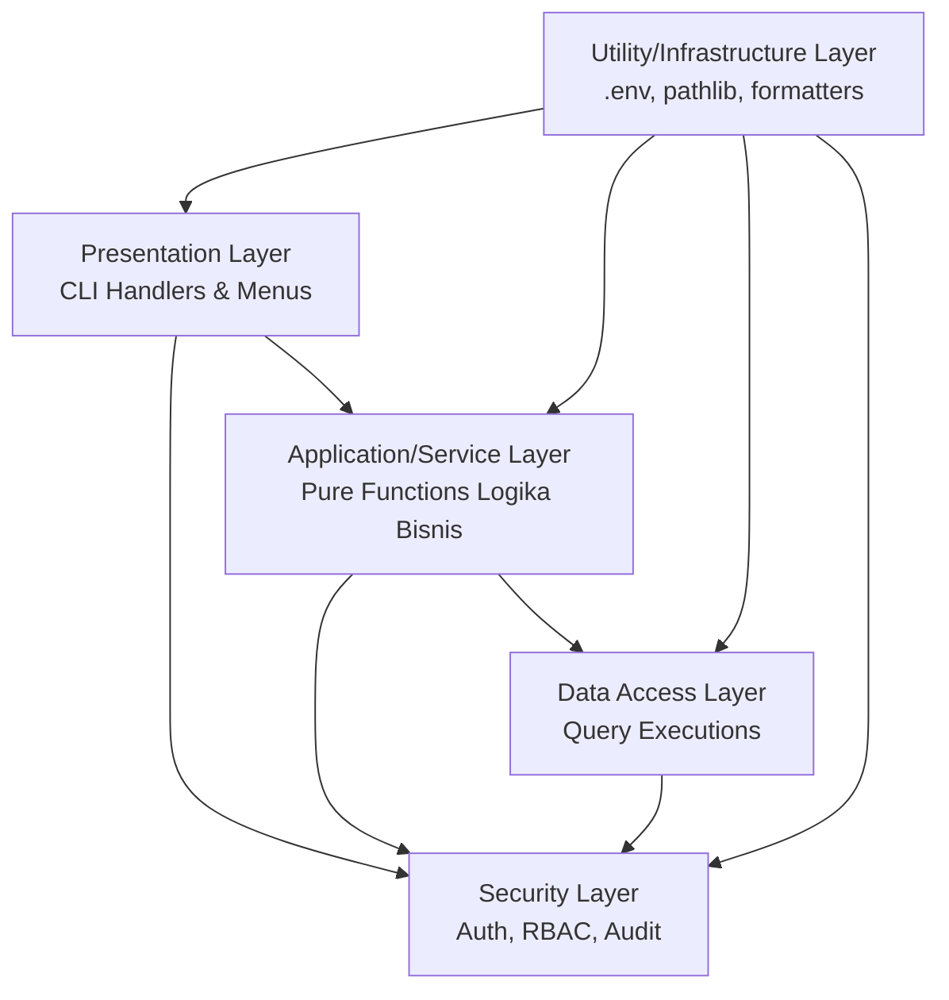

# System Architecture — Sistem Manajemen Usaha Percetakan "AbuCom"

## 1. Metadata Dokumen

| Atribut | Detail |
|---|---|
| **Versi** | 1.1.0 |
| **Status** | [finish] |
| **Tanggal Dibuat** | 2026-05-15 |
| **Disusun Oleh** | Senior Software Architect & Senior System Designer (AI) |

## 2. Pendahuluan

Dokumen System Architecture ini disusun sebagai cetak biru teknis utama yang menjembatani fase Design menuju fase Implementation untuk Sistem Manajemen Usaha Percetakan "AbuCom". Dokumen ini mendefinisikan keseluruhan struktur teknis aplikasi, arsitektur berlapis, pola organisasi kode, struktur direktori, alur data antar komponen, strategi koneksi basis data, mekanisme keamanan, dan strategi penanganan error yang komprehensif.

Aplikasi AbuCom dibangun dengan antarmuka Command Line Interface (CLI) lokal, menggunakan paradigma Functional Programming (FP) murni di Python 3.14.2+ (tanpa menggunakan `class` untuk logika bisnis), berinteraksi dengan pangkalan data MySQL 8.4 LTS, serta dirancang agar siap untuk ekspansi cabang (Multi-Branch Ready).

## 3. Deployment Context

- **Sistem Operasi Target:** Linux Debian 12 Bookworm (kernel 6.1 LTS) dan Windows 11 24H2.
- **Runtime Lingkungan:** Python 3.14.2+ (dijalankan via terminal standar).
- **Basis Data:** MySQL 8.4 LTS Community Edition berjalan secara lokal.
- **Distribusi:** Aplikasi dijalankan secara langsung dari *source code* (monolitik) tanpa perlu proses kompilasi (*build*). Konfigurasi *path* direktori lintas OS ditangani sepenuhnya oleh pustaka `pathlib`.

## 4. Constraint & Batasan Teknis

- **Tanpa Object-Oriented Programming (OOP):** Segala logika bisnis wajib diimplementasikan sebagai *pure functions*. Penggunaan `class` dilarang (kecuali `dataclass` dengan `frozen=True` jika benar-benar krusial untuk struktur data *read-only*).
- **Tanpa Object-Relational Mapping (ORM):** Interaksi dengan basis data menggunakan `mysql-connector-python` secara fungsional. Hasil kueri wajib dikembalikan dalam bentuk *tuple* atau *dictionary* murni.
- **Biaya Lisensi:** Seluruh komponen perangkat lunak (pustaka dan basis data) harus bersifat *open-source* tanpa biaya lisensi.
- **Tanpa Antarmuka Grafis (Fase 1):** Aplikasi sepenuhnya berbasis teks (CLI) tanpa implementasi Web atau Desktop GUI.
- **Global State Dilarang:** Tidak ada variabel *global* untuk sesi. Data *state* diteruskan secara fungsional antar lapis arsitektur.

## 5. Arsitektur Berlapis (Layered Architecture)

Meskipun aplikasi ini merupakan aplikasi monolitik berbasis CLI yang dikembangkan dengan paradigma fungsional, struktur kode diorganisasikan dalam lapisan logis untuk memisahkan tanggung jawab dan memudahkan pemeliharaan.

Lapisan yang digunakan adalah:

1. **Presentation Layer (CLI)**: Lapisan terluar yang menangani antarmuka pengguna di terminal. Bertanggung jawab merender menu berbasis angka, memproses input dari keyboard, dan mencetak output visual (tabel ASCII, slip digital) ke layar. Lapisan ini mendelegasikan logika bisnis ke lapisan di bawahnya.
2. **Application/Service Layer**: Lapisan operasional yang berisi kumpulan fungsi murni (*pure functions*) yang merepresentasikan logika bisnis dari 20 modul aplikasi (misal: perhitungan HPP dari BOM, perhitungan skema gaji, pengelolaan keranjang kasir).
3. **Data Access Layer**: Lapisan terbawah yang menangani interaksi langsung dengan MySQL. Lapisan ini membungkus eksekusi fungsi SQL, menangani transaksi (commit/rollback), dan memformat data kembalian ke dalam struktur data yang *immutable* (*tuple* atau *dict*). Semua eksekusi SQL menambahkan filter *soft delete* (`is_deleted = 0`).
4. **Security Layer**: Lapisan keamanan terpusat yang mengeksekusi pemeriksaan *hashing* dengan `bcrypt`, validasi dan ekstraksi payload `pyjwt`, penegakan *Role-Based Access Control* (RBAC), serta pencatatan audit (*audit trail*).
5. **Utility/Infrastructure Layer**: Lapisan pendukung lintas modul. Berfungsi mengelola variabel `.env` dengan `python-dotenv`, resolusi path direktori (`pathlib`), serta fungsi generator utilitas lainnya.

**Aturan Komunikasi Lapisan:** Lapisan atas diperbolehkan untuk memanggil fungsi dari lapisan bawahnya secara langsung. Namun, aturan mutlak menyatakan bahwa lapisan bawah **TIDAK DIIZINKAN** untuk memanggil lapisan di atasnya.



### 5.1. Dependency Map (Pemetaan Pustaka per Lapisan)

| Lapisan | Pustaka Utama | Fungsi Pustaka pada Lapisan |
|---|---|---|
| Presentation | Pustaka Standar Python | Menangani `input()` dan `print()` ke *stdout*. |
| Application | Pustaka Standar Python | Menggunakan fungsi bawaan `map()`, `filter()`, `reduce()`. |
| Data Access | `mysql-connector-python` | Mengeksekusi kueri `cursor.execute()`, mengelola koneksi dan transaksi ACID. |
| Security | `bcrypt`, `pyjwt` | Mengamankan *password* (`bcrypt`) dan menerbitkan otorisasi sesi (`pyjwt`). |
| Utility | `python-dotenv` | Membaca dan memuat variabel lingkungan dari berkas `.env` lokal. |

## 6. Struktur Direktori Proyek

Direktori disusun mengutamakan kemudahan pelacakan penempatan *pure functions*.

```text
abucom/
├── main.py                     # Entry point (Memuat env, trigger CLI event loop)
├── requirements.txt            # Daftar library versi terkunci (mysql-connector, pyjwt, bcrypt)
├── .env                        # Rahasia konfigurasi (kredensial DB lokal, kunci rahasia JWT)
├── cli/                        # [Presentation Layer]
│   ├── menus.py                # Fungsi render navigasi dinamis berdasar RBAC
│   └── handlers.py             # Fungsi promt masukan pengguna CLI
├── services/                   # [Application/Service Layer]
│   ├── cashier_service.py      # Transaksi Kasir, Harga Grosir/Mitra, Pembatalan/Retur
│   ├── inventory_service.py    # Gudang Stok, BOM, HPP Produksi, Waste Management
│   ├── job_tracking_service.py # Pelacakan Status Antrian & Lokasi Desain
│   ├── hr_payroll_service.py   # SDM, Kehadiran, Kasbon, Skema Penggajian, Poin Insentif
│   ├── finance_service.py      # Transaksi PPOB, Jasa Keuangan Bank, Hutang Piutang
│   └── crm_report_service.py   # Pelanggan, Laba Rugi, Rekonsiliasi Kas Fisik
├── data/                       # [Data Access Layer]
│   ├── connection.py           # Inisiasi koneksi mysql-connector-python murni
│   ├── queries.py              # Fungsi eksekusi query (CRUD FP Tuple-Based)
│   └── migrations/             # Kumpulan file inisiasi DDL schema MySQL
├── security/                   # [Security Layer]
│   ├── auth.py                 # Pengecekan sandi bcrypt dan penerbitan sesi JWT 8 jam
│   ├── rbac.py                 # Filter peran akses (Role-Based Access Control)
│   └── audit.py                # Pemasukan rekaman log riwayat ke entitas audit_trail 
└── utils/                      # [Utility/Infrastructure Layer]
    ├── config.py               # Pemanggilan fungsi konfigurasi dasar os.getenv()
    ├── formatters.py           # Kalkulasi tabel ASCII, konvensi nama desain
    └── backup.py               # Skrip otomatis pencadangan basis data lokal (mysqldump)
```

## 7. Alur Data Utama (Data Flow)

Dalam ekosistem *Functional Programming*, penyelesaian logika bisnis diterapkan dalam wujud rentetan panggilan komposisi (*function composition*) dari fungsi-fungsi murni.

### 7.1. Alur Autentikasi (Login)
1. **Input CLI**: `prompt_login()` meminta `username` dan `password` di layar.
2. **Validasi (*Verify*)**: Fungsi keamanan menarik data *hash* pengguna dari pangkalan data MySQL berdasarkan identitas *username*.
3. **Pencocokan**: Memanggil `bcrypt.checkpw()`. Jika salah, fungsi penghitung inkremental menambahkan kegagalan login (*failed attempt*). Pada percobaan gagal ke-5 berturut-turut, sistem mengubah kolom `is_locked = 1`.
4. **JWT Generate**: Bila berhasil, `jwt.encode()` menerbitkan *payload* berisi `user_id`, `role`, dan `branch_id`, beserta durasi kedaluwarsa 8 jam.
5. **Session Store**: Token disimpan ke dalam tabel `login_sessions`. Fungsi rekam jejak mencatat kejadian aktivitas "LOGIN" di `audit_trail`.
6. **Menu Render**: Filter RBAC membaca status `role` pada *payload* JWT untuk menampilkan daftar menu CLI yang diizinkan. Pengguna yang membiarkan sesi tidak aktif selama 10 menit akan dikeluarkan secara otomatis (*idle timeout*).

### 7.2. Alur Transaksi Kasir Multi-Lini
1. **Pemilihan Item**: Fungsi meminta jenis pesanan (Cetak, ATK, PPOB), ID produk, dan jumlah item (*qty* desimal presisi).
2. **Kalkulasi Harga**: Fungsi mengambil data dari `pricing_tiers`. Skema dievaluasi (harga Grosir bila *qty* >= 50, harga Mitra jika masa aktif pelanggan >= 3 bulan). Sistem menghitung uang muka (DP) bila pelunasan ditunda (minimal 50%).
3. **Kalkulasi BOM & HPP**: Untuk pesanan layanan percetakan, *Service Layer* mengambil data *Bill of Materials* (`bom`). Fungsi reduksi menghitung kebutuhan pemotongan stok bahan baku berdasarkan persentase desimal dan menghasilkan nilai Harga Pokok Penjualan (HPP).
4. **Potong Stok & Transaksi**: Fungsi memanggil `start_transaction()`. Menulis transaksi ke tabel `transactions` dan detail pada `transaction_items`. Mengubah persediaan melalui kueri pada tabel `materials` sejumlah yang digunakan di HPP.
5. **Audit & Penutup**: Memanggil fungsi log untuk menyimpan baris di `audit_trail` secara imutabel, lalu mengeksekusi komitmen mutasi database secara permanen dengan `commit()`.

### 7.3. Alur Penggajian Cerdas (Payroll)
1. **Trigger Manual**: Menjalankan instruksi komputasi penggajian dari menu CLI terkait modul HR.
2. **Hitung Pendapatan**: Fungsi *reduce* merangkum nilai total pendapatan usaha unit terkait pada bulan berjalan dari riwayat transaksi.
3. **Penentuan Skema**: Logika murni diterapkan: Bila pendapatan operasi mencapai Rp 15.000.000 bersih, komponen gaji pokok `base_salary` dikunci di nilai Rp 3.000.000. Jika kurang dari itu, komputasi menggunakan rasio bagi hasil sebesar 15% dari pendapatan bersih bulan itu.
4. **Insentif & Kasbon**: Fungsi mengakumulasikan nilai riwayat pekerjaan di `incentive_points` (berdasarkan kategori Rutin/Dasar/Kustom/Teknis Berat) menjadi nominal bonus rupiah, serta mengurangi tanggungan hutang internal pada `employee_loans` (kasbon).
5. **Slip Gaji Digital**: Hasil keluaran disalin ke entitas tabel `payroll` dan dirender sebagai format teks slip gaji pada antarmuka CLI. Pembuatan entitas ini akan dicatat mutasinya oleh modul audit.

## 8. Strategi Koneksi Database (FP Pattern)

Pendekatan *Functional Programming* murni menolak paradigma arsitektur Object-Relational Mapping (ORM) seperti SQLAlchemy. Interaksi ke pangkalan data direkayasa dengan standar FP:

- **Koneksi Secara Stateless**: Aplikasi tidak menggunakan instansiasi objek koneksi yang dikelola via *class pool*. Aplikasi memanggil fungsi tunggal `create_connection()` yang membaca token lokal dari `.env` dan mengembalikan referensi objek koneksi sesaat.
- **Pola Transaksi ACID**: Fungsi mutasi menulis (`INSERT`, `UPDATE`) selalu berada di dalam kontrol pemanggilan `connection.start_transaction()`. Bila fungsi bisnis berjalan tanpa kendala, fungsi diakhiri dengan `connection.commit()`. Jika terdeteksi eksepsi (seperti validasi gagal atau stok kurang), sistem akan membatalkan rangkaian instruksi secara otomatis dengan `connection.rollback()`.
- **Hasil Data Tuple Immutable**: Menggunakan pustaka resmi *mysql-connector-python*, hasil kueri database dikembalikan langsung dalam format data dasar bawaan Python (*tuple* atau struktur *dictionary* baru). Proses filter akan menggunakan `map()` atau `filter()` bawaan sehingga siklus rilis memori (*garbage collection*) bekerja cepat di RAM.
- **Pengikatan Injeksi Konsisten `branch_id`**: Identitas nomor cabang tidak pernah ditetapkan sebagai variabel status *global*. Semua pemanggilan fungsi yang berinteraksi dengan tabel transaksional wajib melekatkan injeksi eksplisit klausa penapis lokasi berbunyi `WHERE branch_id = ?`.

## 9. Arsitektur Keamanan

Lapisan Arsitektur Security berperan melindungi integritas data operasional:

- **Autentikasi JWT Stateless**: Aplikasi menggunakan kunci rahasia (*secret_key*) algoritma tipe `HS256`. Token memuat struktur *payload* dengan informasi level `role`, `user_id`, `branch_id`. Token juga memiliki masa tenggat (*exp*) maksimum 8 jam.
- **Idle Auto-Logout & Brute-Force Protection**: Proses memantau waktu aktivitas input CLI kasir. Jika tidak ada aktivitas apa pun selama durasi 10 menit berturut-turut, sistem akan invalidasi sesi JWT lokal secara paksa (*idle timeout*). Aplikasi juga mengunci akun dengan skema logikal saat deteksi kesalahan *login* mencapai 5 kali kegagalan (*Brute-force protection*).
- **Role-Based Access Control (RBAC)**: Tidak diperlukan pemeriksaan basis data yang berulang; sistem menapis tingkat otorisasi berdasarkan muatan tingkat peran yang sudah diekstrak saat verifikasi token awal. Jika akses ditolak, nilai yang dikembalikan adalah penolakan mutlak.
- **Soft Delete Framework**: Eksekusi perintah SQL pembongkar relasional `DELETE FROM` dilarang. Mekanisme penghapusan dilakukan secara logikal dengan memanggil rutin kueri pembaruan nilai kolom `UPDATE [tabel] SET is_deleted = 1 WHERE id = ?`. Seluruh proses pengambilan data wajib menyelipkan kondisi tambahan penapis aktif `WHERE is_deleted = 0`.
- **Validasi PIN Transaksi Finansial**: Memiliki batasan limit transfer finansial sebesar Rp 5.000.000. Setiap pengeluaran mutasi jasa keuangan di atas limit tidak bisa di-`commit()` langsung melainkan harus menunggu verifikasi sandi (hash) akun `Pemilik` di dalam *prompt* CLI menggunakan *bcrypt*.
- **Generator Tata Nama File Desain Standar**: Mencegah salah penyusunan laporan direktori desain. Sistem secara otomatis membuat penamaan berkas standar yang harus disalin karyawan ketika pesanan berubah menjadi status "Proses Desain". Formatnya: `[TANGGAL]_[KODE_ORDER]_[NAMA_PELANGGAN]_[ITEM]`.
- **Pencadangan Database Otomatis**: Dilakukan utilitas file `backup.py` yang berjalan di *background* via *cron job* di Linux atau *Task Scheduler* di Windows. Data terekspor via alat internal MySQL (`mysqldump`) kemudian dikompres dan dilindungi enkripsi sandi dengan siklus penahanan retensi data terlama 30 hari.
- **Audit Trail Imutabel**: Semua fungsi pencatatan riwayat transaksional menuliskan data detail mutasi pada entitas `audit_trail` (insert log rahasia). Hal ini menjamin visibilitas kronologi penuh (berdasarkan pengguna, rincian manipulasi spesifik, serta tanggal).

## 10. Strategi Penanganan Error

Perangkat arsitektur AbuCom menerapkan pola pengamanan pesan error agar pengguna atau pihak asing tidak bisa mendiagnosis sistem secara langsung:

- **Penyembunyian Tumpukan Trace (Stack Trace Hiding)**: Layar terminal kasir maupun pelanggan sama sekali tidak boleh menampilkan kesalahan seperti *stack trace Python*, pesan struktur tata bahasa SQL, maupun bocoran *path OS* server. Pengecualian wajib dibalut dalam blok fungsi fungsional penjaga `try-except`.
- **Pesan Antarmuka CLI Ramah**: Laporan kegagalan direduksi ke kalimat peringatan sederhana bagi kelancaran operasional toko. Misal, "Peringatan: Kesalahan validasi data transaksi. Nilai yang dimasukkan tidak logis." Detail lengkap log disimpan di latar belakang internal.
- **Rollback Otomatis di Tengah Transaksi**: Memastikan data separuh proses tidak dibiarkan menggantung, modul pelaksana fungsi akan mengirimkan arahan pembatalan komputasi basis data mutlak melalui `connection.rollback()`.

## 11. Arsitektur Multi-Branch Ready

Sistem dibangun sejak hari pertama tidak hanya berorientasi tunggal:

- Entitas `branch_id` bertindak sebagai batasan isolasi pada seluruh entitas relasional operasional database (misal tabel logistik, transaksi, kasir, karyawan).
- Nilai identitas ini dibaca dengan murni dari parameter rahasia di dalam token otentikasi JWT saat momen verifikasi `Login`.
- Seluruh baris kode penyusunan kueri modifikasi tabel diwajibkan secara mutlak menyelipkan logika `WHERE branch_id = ?` ke dalam klausa pembatasan eksekusinya.

## 12. Pemetaan Modul ke Entitas Database

Semua 20 modul fungsional dari *Project Charter* dipetakan secara ketat ke struktur tabel DDL:

| Modul Fungsional | Tabel Database Utama | Tabel Database Pendukung |
|---|---|---|
| (1) Manajemen Produk Percetakan | `products_services`, `orders_job_tracking` | `transactions`, `transaction_items` |
| (2) Penjualan ATK | `products_services`, `transactions` | `transaction_items`, `pricing_tiers` |
| (3) Layanan PPOB | `ppob_accounts`, `ppob_mutations` | `transactions` |
| (4) Jasa Keuangan | `ppob_accounts`, `ppob_mutations` | `transactions`, `loans` |
| (5) Jasa Teknis | `products_services`, `transactions` | `transaction_items` |
| (6) Stok & Gudang | `materials`, `stock_opname` | `production_waste`, `products_services` |
| (7) HPP & BOM | `bom`, `materials` | `products_services`, `transaction_items` |
| (8) Harga & Pembayaran | `pricing_tiers`, `payments` | `transactions`, `customers` |
| (9) Antrian & Job Tracking | `orders_job_tracking`, `transactions` | `customers` |
| (10) SDM & Penggajian | `employees`, `employee_attendance` | `payroll`, `employee_loans` |
| (11) Poin Karyawan | `incentive_points`, `employees` | `payroll` |
| (12) Manajemen Pinjaman | `loans`, `employee_loans` | `employees` |
| (13) Keuangan & Pelaporan | `cash_reconciliation`, `routine_expenses` | `transactions`, `payments`, `payroll` |
| (14) Manajemen Aset | `assets`, `asset_savings` | `routine_expenses` |
| (15) Supplier & Hutang Usaha | `vendors`, `materials` | `loans` |
| (16) Database Pelanggan (CRM) | `customers`, `transactions` | `pricing_tiers` |
| (17) Keamanan & Audit | `users`, `audit_trail` | `login_sessions` |
| (18) Input Data Awal (Migrasi) | Seluruh Tabel Master | Seluruh Tabel Pendukung |
| (19) Arsitektur Multi-Cabang | `branches` | Seluruh Tabel Transaksional |
| (20) Inovasi & Best Practice | `audit_trail`, `orders_job_tracking` | `users`, Seluruh Tabel (`is_deleted`) |

## 13. Standar Kode FP (Functional Programming) yang Wajib Diterapkan

Sistem secara ketat melarang pendekatan desain Object-Oriented Programming (OOP). Pengembang aplikasi ini wajib memastikan setiap arsitektur berbasis prinsip dasar FP murni:

- **Fungsi Murni (*Pure Functions*)**: Setiap pemanggilan dan pengembalian hasil didasari mutlak oleh argumen *input*. Modul menghindari *side effect* serta modifikasi nilai variabel global di luar fungsinya. Hasil pemanggilan data selalu diproses dan diubah wujud baru yang identik jika input-nya konsisten.
- **Struktur Data Imutabel (*Immutable Data*)**: Variabel penampung hasil query dihindari pembaruan di memori *in-place*. Modul wajib menggunakan tupel `tuple` atau membangun ulang larik dasar struktur kamus data (`dictionary` murni yang ter-salin mandiri) bawaan memori Python.
- **Tanpa Representasi Kelas**: Kata kunci `class` dilarang digunakan untuk pembentukan bisnis (*business entity representation*). Seluruh proses modifikasi direpresentasikan dalam bentuk argumen penerus. `dataclass` hanya dibolehkan sebagai pengecualian minor bila atribut `frozen=True` diselipkan spesifik bagi transfer beban data besar paket antarlapis logika bisnis.
- **Fungsi Tingkat Tinggi (*Higher Order Function*)**: Operasi pembacaan filter data kolektif tabel rekapitulasi, pengaturan hasil laporan bulanan, diwajibkan memanfaatkan iterator dasar komprehensi memori Python lewat penggunaan metode `map()`, fungsi `filter()`, serta fungsi agregat dasar `functools.reduce()`.

**Contoh Kode (Batasan FP vs OOP):**

```python
# DILARANG (OOP):
# Menggunakan class dan merubah internal state secara in-place.
# class TransactionService:
#     def calculate(self): 
#         self.total = self.price * self.qty

# WAJIB (FP):
# Fungsi murni mengembalikan tuple/data struktur baru.
# def calculate_transaction(conn, branch_id, items) -> tuple:
#     subtotal = sum(item['price'] * item['qty'] for item in items)
#     return (items, subtotal)
```

## 14. Panduan Eksekusi dan Pola State Passing

- **Strategi Entry Point Tunggal (main.py)**: Seluruh pemanggilan rutinitas eksekusi bersumber ke fail `main.py`. Skrip memanggil fungsi untuk membaca `.env` menggunakan paket modul `os.getenv()`, menghasilkan koneksi fungsi data persisten *database*, dan memulai pengait `start_cli_interface()`.
- **Pola Komposisi Fungsi Rantai (*Function Composition*)**: Rangkaian logika bisnis tidak tersusun dalam struktur pewarisan (Inheritance) seperti OOP, melainkan dipanggil secara komposisi fungsional bertingkat, dengan hasil tangkapan satu fungsi menyeberang langsung sebagai argumen input di pemrosesan fungsi di lapisan selanjutnya.
  *Contoh Alur Bisnis Transaksi*: `validate_input() -> check_pricing_tier() -> calculate_hpp() -> deduct_stock() -> record_transaction() -> log_audit()`
- **Pola State Passing**: Sistem membuang semua deklarasi sesi `global_session`. Seluruh variabel informasi lingkungan seperti tupel (*state antarmuka aktif, referensi modul koneksi db, data sesi eksekusi JWT aktif, identitas unit* `branch_id`) tidak pernah menetap statik. Melainkan selalu di-pas (*Context Passing* / *State Passing*) sebagai baris tambahan penerus parameter argumen fungsi ke modul yang memanggilnya.

**Contoh Pola State Passing:**

```python
# Fungsi utama meneruskan konteks JWT payload dan db connection
def handle_cashier_menu(db_conn, jwt_payload):
    branch_id = jwt_payload['branch_id']
    user_id = jwt_payload['user_id']
    
    # Context (state) diteruskan sebagai argumen
    transaction_result = process_order(db_conn, branch_id, user_id, order_items)
    return render_receipt(transaction_result)
```

## 15. Non-Functional Requirements Coverage

- **Performance**: Pemilihan driver *mysql-connector-python* yang dieksekusi fungsional ke MySQL 8.4 mampu mengakomodasi waktu komputasi optimal dengan latensi interaktif CLI < 150 ms per baris perintah interaktif layar.
- **Maintainability**: Pola tata letak *layered architecture* memungkinkan lokalisasi pemeliharaan setiap modul. Penggunaan FP membantu meminimalisasi anomali pemeliharaan jangka panjang dan pelacakan kesalahan penelusuran berkat tidak adanya *state* objek pewarisan yang kompleks.
- **Security**: Injeksi terpadu pengaman fungsional pustaka `bcrypt` dan `pyjwt`, arsitektur kerangka logika pelindung `is_deleted = 0`, serta rekonsiliasi pencegahan peretasan `SQL injection` dilakukan secara murni lewat injeksi parameter kueri SQL tuple di sisi pangkalan data.

## 16. Glossary / Istilah

- **FP (Functional Programming):** Paradigma pemrograman terstruktur yang menghindari efek samping eksternal, di mana program dirakit dengan penerapan fungsi matematis murni (menerima argumen input, menghasilkan keluaran baru).
- **Immutable Data:** Struktur data wadah penampung nilai memori variabel yang tidak dapat diubah lagi keadaannya pasca dibentuk untuk pertama kalinya.
- **Soft Delete:** Teknik mempertahankan arsip fisik pada memori dengan sekadar mengubah penandaan status menjadi atribut tidak relevan lagi secara logis.
- **RBAC:** Skema pengendalian akses otoritas berbasis parameter pemisahan kewenangan identitas yang diekstrak dalam JWT.
- **BOM (Bill of Materials):** Rincian bahan yang mutlak disyaratkan agar pencetakan satu unit produk selesai menjadi luaran produk akhir.

## 17. Riwayat Versi

| Versi | Tanggal | Diubah Oleh | Keterangan |
|---|---|---|---|
| 1.0.0 | 2026-05-15 | Senior Software Architect & Senior System Designer (AI) | Pembuatan struktur dasar System Architecture Document dengan mencakup arsitektur berlapis, implementasi mutlak FP murni, pola aliran integrasi transaksi, strategi Multi-Branch Ready, integrasi modul inovasi, penempatan layer keamanan RBAC, dan matriks MySQL. |
| 1.1.0 | 2026-05-15 | Senior Software Architect (AI) | Validasi menyeluruh: perbaikan bahasa profesional, pengisian data kosong, penambahan bagian yang hilang (Dependency Map, Constraint Teknis, NFR, Glossary), komparasi 5 inovasi, komparasi referensi 20 modul, serta peningkatan kelayakan dokumen sebagai referensi utama fase implementasi lanjutan. |

## 18. Referensi Dokumen

- `docs/sdlc/narasi.txt`
- `docs/sdlc/01_planning/01_project_charter.md`
- `docs/sdlc/01_planning/04_tech_stack_decision.md`
- `docs/sdlc/01_planning/05_innovation_proposal.md`
- `docs/sdlc/02_analysis/02_software_requirements.md`
- `docs/sdlc/02_analysis/06_access_control_matrix.md`
- `docs/sdlc/03_design/01_database_schema.sql`
- `docs/sdlc/03_design/02_erd_database.puml`
